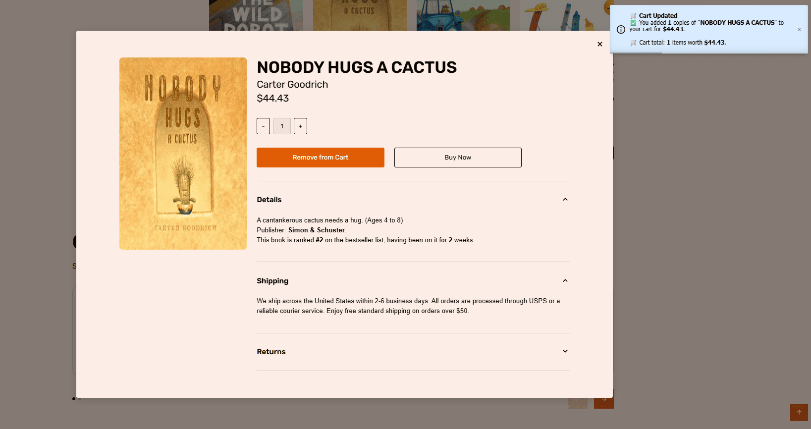

# Booksy

One-page responsive e-commerce website for browsing books, viewing book details, joining literary events, and managing a local shopping cart.

Booksy was built as a team project during the GoIT Fullstack program. The app uses a modular Vanilla JavaScript architecture with Vite, REST API integration, interactive sliders, accessible modals, local cart persistence, and responsive layouts for mobile, tablet, and desktop screens.

## Live Demo

- Frontend: [https://oleksandr-sulyma.github.io/project-SURVIVORS-CODE/](https://oleksandr-sulyma.github.io/project-SURVIVORS-CODE/)
- Repository: [project-SURVIVORS-CODE](https://github.com/Oleksandr-Sulyma/project-SURVIVORS-CODE)

## Preview




## Features

- One-page online bookstore layout
- Responsive mobile-first design
- Dynamic book catalog loaded from REST API
- Category filtering for books
- Pagination with "Show more" behavior
- Book details modal with additional information
- Add to cart and remove from cart actions
- Quantity controls in the book modal
- Cart state persisted in localStorage
- Buy now flow with user feedback notifications
- Hero, feedback, and events sliders
- Event registration modal with form validation
- Footer subscription form with validation
- Scroll-to-top control
- Lazy image loading
- Local in-memory API cache for faster repeated requests
- Accessible modal interactions: close button, backdrop click, and Escape key

## Tech Stack

- HTML5
- CSS3
- JavaScript ES Modules
- Vite
- Axios
- Swiper
- MicroModal
- Accordion.js
- iziToast
- PostCSS
- modern-normalize
- GitHub Pages

## Project Structure

```text
project-SURVIVORS-CODE/
  docs/
    screenshots/
  src/
    assets/
    css/
      common-styles/
      sections-style/
    img/
    js/
    partials/
    public/
    index.html
    main.js
  package.json
  vite.config.js
```

## Getting Started

### 1. Clone the repository

```bash
git clone https://github.com/Oleksandr-Sulyma/project-SURVIVORS-CODE.git
cd project-SURVIVORS-CODE
```

### 2. Install dependencies

```bash
npm install
```

### 3. Run the development server

```bash
npm run dev
```

### 4. Build for production

```bash
npm run build
```

### 5. Preview production build

```bash
npm run preview
```

## Available Scripts

| Script | Description |
| --- | --- |
| `npm run dev` | Start the Vite development server |
| `npm run build` | Build the project for GitHub Pages |
| `npm run preview` | Preview the production build locally |

## API Integration

The project uses the GoIT books API:

```text
https://books-backend.p.goit.global
```

Main API features:

- Fetch book categories
- Fetch top books
- Fetch books by category
- Fetch book details by ID

The API layer includes request timeout handling, retry attempts, response normalization, deduplication, and in-memory caching.

## Application Sections

| Section | Description |
| --- | --- |
| Header | Navigation and mobile menu |
| Hero | Main promotional section with slider |
| Books | Dynamic catalog, categories, pagination, and book cards |
| Feedbacks | Reader reviews slider |
| Events | Literary events slider and registration modal |
| Article | Informational content block |
| Location | Store/location section |
| Footer | Subscription/contact area |

## Architecture Notes

- Vite is configured with `src` as the project root and builds to `dist`.
- HTML partials are injected with `vite-plugin-html-inject`.
- CSS is organized into common styles and section-specific styles.
- Book API logic is isolated in `src/js/api-service.js`.
- Catalog rendering and pagination are managed by the `BooksSection` class.
- Cart operations are isolated in `src/js/cart.js` and persisted through localStorage.
- Book and event modals include keyboard and backdrop interactions.
- Swiper is used for hero, feedback, and events sliders.

## Team

- Team Lead: Oleksandr Sulyma
- Scrum Master: Anastasiia Chaplyhina
- Frontend Developers: Serhii Borodulin, Serhii Kutovyi, Anna Ovcharenko, Ihor Orikh, Danyil Vorobiov, Volodymyr Triukhan
- QA / Testers: Serhii Borodulin, Serhii Kutovyi

## My Role

As Team Lead and Frontend Developer, I coordinated the team workflow, helped organize task distribution and pull requests, and contributed to the modal window functionality and project integration.

## Author

Oleksandr Sulyma

- GitHub: [Oleksandr-Sulyma](https://github.com/Oleksandr-Sulyma)
- LinkedIn: [oleksandr-sulyma](https://www.linkedin.com/in/oleksandr-sulyma/)
